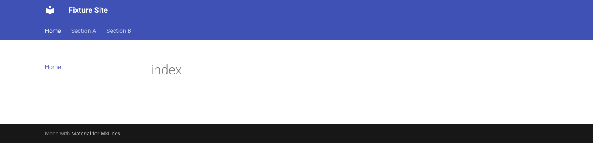
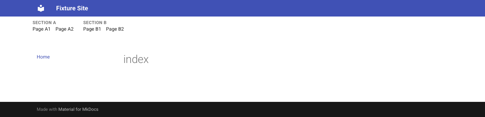

# mkdocs-nested-tabs

Shows two hierarchy levels of `navigation.tabs` - one parent level, with it's children 
displayed below it. An alternative to Material for MkDocs' native hover-triggered 
tab dropdown (one category's children at a time). 

Without the plugin — categories only, children reachable via a hover dropdown:



With the plugin — every category's pages listed at once:



## Status

Published on PyPI. Ported and generalized from a working implementation.

## Install

```bash
pip install mkdocs-nested-tabs
```

```yaml
# mkdocs.yml
theme:
  name: material
  features:
    - navigation.tabs

plugins:
  - nested-tabs
```

Requires `navigation.tabs` to be enabled — this plugin replaces that
feature's tab bar on desktop widths (≥76.234375em, matching Material's own
breakpoint), it doesn't work alongside a site with tabs disabled.

Compatible with `navigation.indexes` — a category label whose own index page
Material merges in becomes a real link to that page, with correct
active/current-page state.

## How it works

Reads Material's own primary sidebar nav at runtime (which already contains
the full site tree — every category, not just the active one) and builds a
second row inserted directly into `.md-header`, right after `.md-tabs`, so
it inherits the header's own sticky positioning and background for free. A
category with a third nesting level (a sub-category with its own children,
rather than a flat list of pages) doesn't fit the "category + pages" shape
this renders, so it falls back to a single link using the first leaf page
found inside it.

## Config

```yaml
plugins:
  - nested-tabs:
      enabled: true   # default
```

A configurable breakpoint and an option to keep Material's native tabs 
alongside this row instead of hiding them. Both need the static JS/CSS to 
be templated per-build rather than shipped as fixed package assets.

## Theming

Falls back to Material's own `--md-default-fg-color`/`--md-accent-fg-color`
so it looks reasonable on any palette out of the box. Override via:

```css
:root {
  /* Default (inactive) label/link color */
  --md-nested-tabs-label-color: ...;
  --md-nested-tabs-link-color: ...;

  /* Active label/link color — the label gets .nested-tabs__label--active
     when one of its own pages is active, not just the page link itself */
  --md-nested-tabs-label-active-color: ...;
  --md-nested-tabs-link-active-color: ...;

  /* Hover/focus label/link color */
  --md-nested-tabs-label-hover-color: ...;
  --md-nested-tabs-link-hover-color: ...;
}
```

## Development

```bash
python3 -m venv .venv && source .venv/bin/activate
pip install -e . mkdocs-material pytest
python -m pytest tests/
```

Manual check: `cd tests/fixture_site && mkdocs serve`, then open the site
and confirm the nested-tabs row renders at desktop width.
